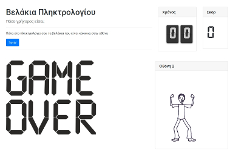

# Παιχνίδι με βελάκια πληκτρολογίου

Ένα απλό παιχνίδι για να μετρά την ταχύτητα με την οποία μπορεί να πατάει κανείς τα βελάκια του πληκτρολογίου.
Το παιχνίδι αυτό ετοιμάστηκε για τους μαθητές της Α' τάξης αλλά τελικά άρεσε σε μαθητές όλων των τάξεων!

## Gameplay
Πάτησε το μπλε κουμπί Εκκίνηση.

Μετά από 3 δευτερόλεπτα το παιχνίδι ξεκινάει.

Κάθε φορά που πατάς το σωστό βελάκι (αυτό που είναι κόκκινο) παίρνεις ένα πόντο. Αν πατήσεις λάθος βελάκι, χάνεις ένα πόντο.

Έχεις 30 δευτερόλεπτα για να κάνεις το μεγαλύτερο σκορ που μπορείς. Αν κάνεις πάνω από 60 με 70 είσαι σοβαρός παίκτης!

## Γλώσσα προγραμματισμού
Το παιχνίδι με γραμμένο σε Javascript (jquery), οπότε η μοναδική του απαίτηση είναι ένας σύγχρονος φυλλομετρητής (web browser)

## Πως παίζω;
Αν θες να παίξεις χωρίς να κατεβάσεις το παιχνίδι, πήγαινε στο [sxoleio.pw](http://www.sxoleio.pw/static/velakia)

Αν θέλεις να το κατεβάσεις στον υπολογιστή σου (ώστε να παίζεις και χωρίς internet) απλά κλονοποιείς ή κατεβάζεις αυτό το αποθετήριο και κάνεις διπλό κλικ στο αρχείο index.html ή το ανοίγεις μέσα από τον φυλλομετρητή σου (Μενού Αρχείο - Άνοιγμα)
